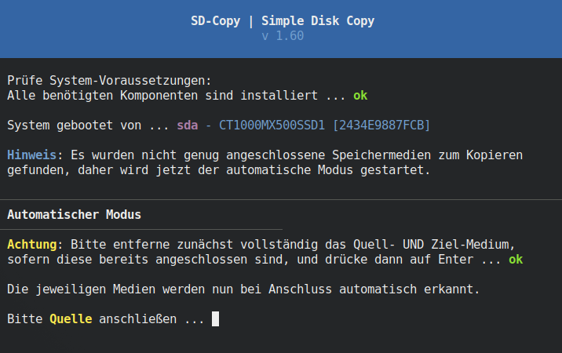
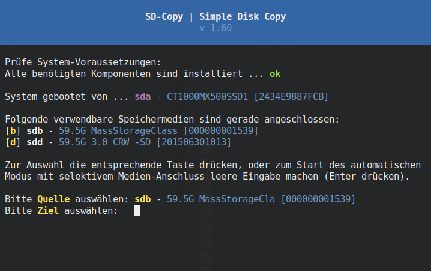

# SD-Copy - Simple Disk Copy
Einfaches Front-End Script für <b>ocs-onthefly</b> (Clonezilla) und <b>dd</b> zum Kopieren bzw. Klonen von beliebigen Speichermedien wie SD-Karten, USB-Sticks, Festplatten etc. 
Wem die Bedienung von Clonezilla zu aufwendig ist, der kann einen Kopiervorgang mit diesem Tool sehr viel einfacher erledigen. Alle angeschlossenen Laufwerke werden nach dem Start des Skriptes direkt angezeigt und können sofort einfach mit ihrem durch das Betriebssystems zugeordneten "Buchstaben" ausgewählt werden. 
Alternativ dazu gibt es einen interaktiven Modus, bei welchem man nacheinander das Quell- und Ziel-Laufwerk anschließen kann und <b>SD-Copy</b> diese dabei automatisch erkennt und auswählt. 
Bei dem Kopiervorgang werden dann wahlweise nur die belegten oder alle Sektoren des Speichermediums kopiert, wobei die erste Option erheblich Zeit spart. 
Darüber hinaus wird auch immer der erste Sektor des Speichermediums mit dem Bootloader (MBR) kopiert, so dass dieser auf der Kopie nicht mehr nachträglich mit externen Tools korrigiert werden muss. 
Zudem wird auch immer der erste Sektor des Speichermediums mit dem Bootloader (MBR) kopiert, so dass dieser auf der Kopie nicht mehr nachträglich mit externen Tools korrigiert werden muss. 
Es ist allerdings auch möglich, nur den Bootloader alleine zu kopieren oder diesen beim Kopier-Vorgang auszulassen, was bei der Reparatur nicht mehr startfähiger Systeme hilfreich sein kann. 
Darüber hinaus wird der Kopier-Vorgang bei Lesefehlern nicht abgebrochen, sondern es wird versucht möglich viele Daten zu retten.
 
<b>Automatischer Modus</b> 
 
<b>Interaktiver Modus</b> 

 
 
<b>Download</b> SD-Copy&nbsp;&raquo;&nbsp;<a href="https://github.com/migacode/sd-copy/blob/main/sd-copy"><strong>sd-copy</strong></a> 
(Nach dem Download "<b>chmod a+x</b>" nicht vergessen ;)
 
 
<b>Optionen zum Aufruf per Kommandozeile:</b> 
<code>
&nbsp;&nbsp;-a,&nbsp;--automode&nbsp;&nbsp;Startet immer direkt den automatischen Medien-Auswahl-Modus. 
 
&nbsp;&nbsp;-b,&nbsp;--bootonly&nbsp;&nbsp;Kopiert NUR den Bootsektor (MBR) und keine sonstigen Daten 
&nbsp;&nbsp;&nbsp;&nbsp;&nbsp;&nbsp;&nbsp;&nbsp;&nbsp;&nbsp;&nbsp;&nbsp;&nbsp;&nbsp;&nbsp;&nbsp;&nbsp;&nbsp;(setzt die Optionen ocsmode und deepmode außer Kraft). 
 
&nbsp;&nbsp;-d,&nbsp;--deepmode&nbsp;&nbsp;Verwendet den Deep-Modus (dd) für den Kopier-Vorgang. 
&nbsp;&nbsp;&nbsp;&nbsp;&nbsp;&nbsp;&nbsp;&nbsp;&nbsp;&nbsp;&nbsp;&nbsp;&nbsp;&nbsp;&nbsp;&nbsp;&nbsp;&nbsp;Dabei werden sämtliche Sektoren der Quelle kopiert, was 
&nbsp;&nbsp;&nbsp;&nbsp;&nbsp;&nbsp;&nbsp;&nbsp;&nbsp;&nbsp;&nbsp;&nbsp;&nbsp;&nbsp;&nbsp;&nbsp;&nbsp;&nbsp;zu einer sehr langen Dauer des Kopier-Vorgangs führen kann. 
 
&nbsp;&nbsp;-h,&nbsp;--help&nbsp;&nbsp;&nbsp;&nbsp;&nbsp;&nbsp;Zeigt diese Hilfe an. 
 
&nbsp;&nbsp;-n,&nbsp;--noupdate&nbsp;&nbsp;Sucht nicht nach Updates für dieses Skript. 
 
&nbsp;&nbsp;-o,&nbsp;--ocsmode&nbsp;&nbsp; Verwendet den OCS-Modus (Clonezilla) für den Kopier-Vorgang. 
&nbsp;&nbsp;&nbsp;&nbsp;&nbsp;&nbsp;&nbsp;&nbsp;&nbsp;&nbsp;&nbsp;&nbsp;&nbsp;&nbsp;&nbsp;&nbsp;&nbsp;&nbsp;Dabei werden nur belegte Sektoren der Quelle kopiert, was 
&nbsp;&nbsp;&nbsp;&nbsp;&nbsp;&nbsp;&nbsp;&nbsp;&nbsp;&nbsp;&nbsp;&nbsp;&nbsp;&nbsp;&nbsp;&nbsp;&nbsp;&nbsp;den Kopiervorgang je nach Belegung erheblich beschleunigt 
&nbsp;&nbsp;&nbsp;&nbsp;&nbsp;&nbsp;&nbsp;&nbsp;&nbsp;&nbsp;&nbsp;&nbsp;&nbsp;&nbsp;&nbsp;&nbsp;&nbsp;&nbsp;(die Option ocsmode setzt die Option deepmode außer Kraft). 
 
&nbsp;&nbsp;-s,&nbsp;--starter&nbsp;&nbsp; Erstellt einen Desktop-Starter mit aktuellen Einstellungen. 
 
&nbsp;&nbsp;-t,&nbsp;--noboots&nbsp;&nbsp; Kopiert den Bootsektor (MBR) der Quelle NICHT und lässt den 
&nbsp;&nbsp;&nbsp;&nbsp;&nbsp;&nbsp;&nbsp;&nbsp;&nbsp;&nbsp;&nbsp;&nbsp;&nbsp;&nbsp;&nbsp;&nbsp;&nbsp;&nbsp;Bootsektor des Ziels unverändert. Diese Option steht nur in 
&nbsp;&nbsp;&nbsp;&nbsp;&nbsp;&nbsp;&nbsp;&nbsp;&nbsp;&nbsp;&nbsp;&nbsp;&nbsp;&nbsp;&nbsp;&nbsp;&nbsp;&nbsp;Verbindung mit dem OCS-Kopier-Modus (ocsmode) zur Verfügung. 
</code>
 

 
Sämtliche Software auf diesen Seiten wird ohne Mängelgewähr und ohne jegliche ausdrückliche oder stillschweigende Garantie zur Verfügung gestellt, einschließlich und ohne Einschränkung jeglicher Garantie für die Gebrauchstauglichkeit oder Eignung für einen bestimmten Zweck. Alle Risiken in Bezug auf Ergebnisse und Leistung dieser Software werden vollständig vom Benutzer übernommen!
